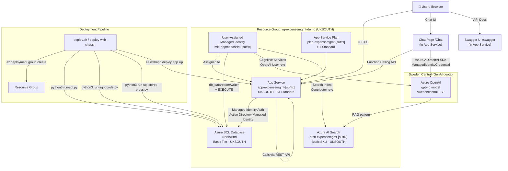

# Azure Services Diagram

This diagram shows all Azure services created by this repository and how they connect.

## Services Summary

| Service | Name Pattern | Region | SKU | Purpose |
|---------|-------------|--------|-----|---------|
| App Service Plan | `plan-expensemgmt-[suffix]` | UKSOUTH | S1 Standard | Hosts the web app |
| App Service | `app-expensemgmt-[suffix]` | UKSOUTH | S1 Standard | ASP.NET Razor Pages + APIs |
| Azure SQL Server | `sql-expensemgmt-[suffix]` | UKSOUTH | - | SQL Server (Entra ID only) |
| Azure SQL Database | `Northwind` | UKSOUTH | Basic | Expense data |
| User-Assigned MI | `mid-appmodassist-[suffix]` | UKSOUTH | - | Authentication identity |
| Azure OpenAI | `oai-expensemgmt-[suffix]` | Sweden Central | S0 | GPT-4o for chat |
| Azure AI Search | `srch-expensemgmt-[suffix]` | UKSOUTH | Basic | RAG knowledge base |

> **Note:** Azure OpenAI is deployed to **Sweden Central** even when the resource group is in UKSOUTH, to ensure GPT-4o model quota availability.
